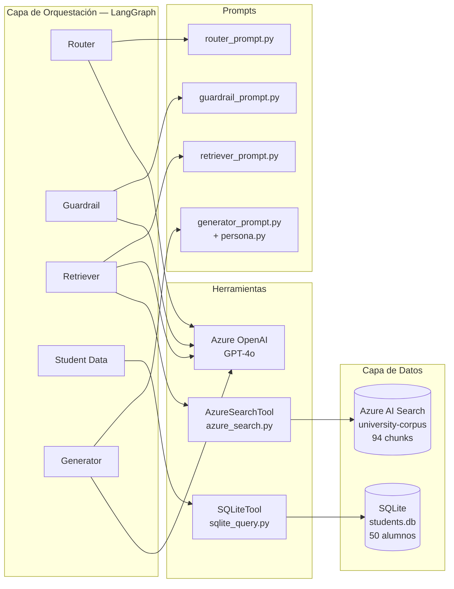

# Arquitectura de Agentes
> Generado al completar la Fase 3B

## Descripción
El sistema se organiza en cuatro capas diferenciadas. La capa de
orquestación contiene los cinco agentes implementados como nodos
LangGraph. Cada agente que necesita razonamiento de lenguaje natural
llama a GPT-4o a través de Azure OpenAI usando su prompt específico.
Los agentes Retriever y Student Data acceden a las capas de datos
mediante tools dedicadas: AzureSearchTool para la búsqueda vectorial
en el índice de Azure AI Search y SQLiteTool para la consulta del
expediente académico en la base de datos local.
