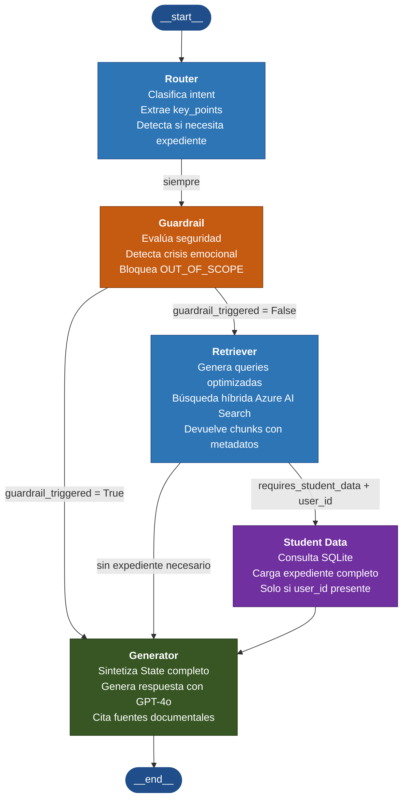

# Flujo del Grafo de Agentes — LangGraph
> Generado al completar la Fase 3B

## Descripción del flujo
Cada mensaje del usuario recorre siempre los nodos Router y Guardrail.
El Router clasifica la intención y extrae los puntos clave. El Guardrail
evalúa si la consulta es segura y está dentro del ámbito universitario.
Si el Guardrail se activa, la respuesta predefinida llega directamente
al Generator sin pasar por búsqueda ni expediente. En el flujo normal,
el Retriever busca en Azure AI Search y, si la consulta requiere datos
personales y hay un alumno identificado, el nodo Student Data carga su
expediente académico desde SQLite. El Generator siempre es el último nodo
activo antes de devolver la respuesta al usuario.
