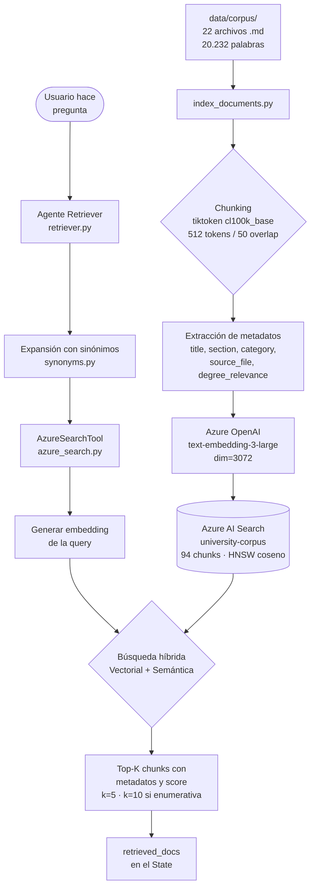

# Arquitectura de Datos — Pipeline RAG
> Generado al completar la Fase 2: Azure AI Search e Indexación

## Descripción
El pipeline RAG del sistema universitario consta de dos fases diferenciadas.
En la fase de indexación, los 19 documentos del corpus se dividen en chunks
de 512 tokens con tiktoken, se enriquecen con metadatos estructurados y se
vectorizan con text-embedding-3-large antes de subirse al índice de Azure
AI Search. En la fase de recuperación, cada consulta del usuario pasa por
la misma vectorización y se ejecuta una búsqueda híbrida que combina
similitud vectorial y comprensión semántica, devolviendo los fragmentos
más relevantes con sus fuentes para que el Agente Generador pueda
fundamentar sus respuestas.
