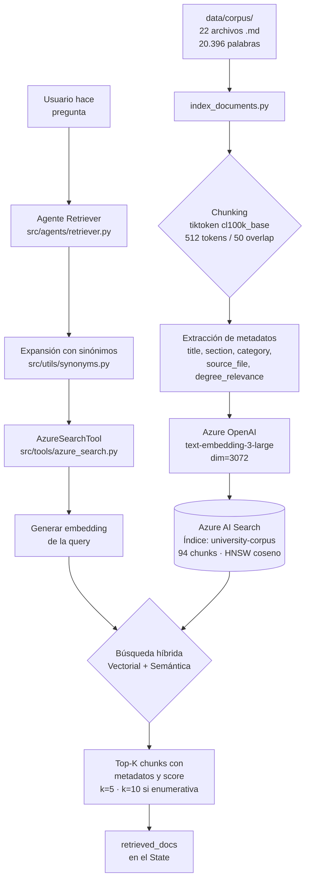

# Arquitectura de Datos — Pipeline RAG
> Generado al completar la Fase 2: Azure AI Search e Indexación (22 documentos, 20.396 palabras, 94 chunks)

## Descripción
El pipeline RAG del sistema universitario consta de dos fases diferenciadas.
 
En la **fase de indexación**, ejecutada una sola vez y de forma independiente al
funcionamiento del sistema, los 22 documentos del corpus se dividen en fragmentos
de 512 tokens con un solapamiento de 50, medidos con el tokenizador `cl100k_base`
de tiktoken. Cada fragmento se enriquece con metadatos estructurados que permiten
citar la fuente con precisión, se vectoriza con text-embedding-3-large en 3072
dimensiones y se sube al índice `university-corpus` de Azure AI Search, que
almacena un total de 94 fragmentos.
 
En la **fase de recuperación**, ejecutada en cada consulta, el agente Retriever
construye la consulta de búsqueda a partir de los puntos clave identificados por
el Router y la enriquece con sinónimos del ámbito universitario. La consulta
resultante se vectoriza con el mismo modelo de embeddings empleado en la
indexación —requisito indispensable para que las distancias en el espacio
vectorial sean comparables— y se ejecuta una búsqueda híbrida que combina
similitud vectorial mediante HNSW con coseno y reordenación por relevancia
semántica. El sistema devuelve los cinco fragmentos más relevantes con sus
metadatos y puntuación, ampliados a diez cuando el Router ha clasificado la
consulta como enumerativa, y los deposita en el campo `retrieved_docs` del estado
para que el Generador fundamente su respuesta.